# Red Alert 2: Yuri's Revenge — Static Recompilation

Static recompilation of **Command & Conquer: Red Alert 2 — Yuri's Revenge**
(Westwood Studios, 2001) from its shipping Win32 binary, `gamemd.exe` 1.001,
to native C. The goal past running it is the remaster the first two C&C games
got and this engine never did: higher resolutions, proper scaling and a modern
presentation layer, built on the game's own code rather than a reimplementation.

Built on the [pcrecomp](https://github.com/sp00nznet/pcrecomp) toolchain and
following its shared house style (layout, CLI, harness, headless mode). It
sits next to [cc](https://github.com/sp00nznet/cc), which takes Tiberian Dawn
and Red Alert from their released source; this engine has no released source.

This is not [OpenRA](https://www.openra.net/). OpenRA is a separate engine
that loads the original assets and reimplements the rules; this project runs
Westwood's own code, recompiled.

## Status: **v0.1.0-dev, bring-up.** The whole game lifts with 0 errors, and the recompiled game plays: every main-menu screen, skirmishes from setup to the score screen, and both campaigns into their first mission, driven headless by a scripted test suite.

| Stage | State |
|---|---|
| P0: pick the build | the Steam build of *The Ultimate Collection*: `gamemd.exe`, 2001-10-31, no DRM, launcher check already patched out ([RECON.md](docs/RECON.md)) |
| RTTI class recovery | 954 classes, 1,214 vtables, 6,665 virtual methods |
| Function catalog (`disasm32`) | 22,682 functions, 89.0% of `.text`, 15 minutes |
| Lift (`run_lift.py --all`) | 23,458 functions, 5.1M lines of C, **0 lift errors** |
| Host (`build/ra2.exe`, 32-bit, pcrecomp `native32`) | boots: CRT and 3,952 static constructors, `WinMain`, COM servers, window, DirectDraw at 800x600x16, the Westwood logo and the intro movie through Bink, and the **main menu**, drawn and animated ([bringup.md](docs/bringup.md)) |
| Playtest suite (`tools/playtest.py`) | **23 of 23 passing**: every menu screen, every way back, a skirmish start to score screen, the Allied and Soviet campaigns: scripted by button name, run in parallel, and `--original` runs the same script on the shipping code to tell lift bugs from host bugs ([testing.md](docs/testing.md)) |
| Presenter (the default display) | the game in its own Direct3D 11 window: sharp-bilinear, smooth, CRT, nearest or integer scaling (F12), borderless fullscreen (F11), native resolution on high-DPI screens; `--classic` is the original DirectDraw ([presenter.md](docs/presenter.md)) |
| High resolution / widescreen | 1280x720, 1920x1080 and 2560x1440 in game, skirmish and campaign, from the game's own `RA2MD.INI` setting; 4K hits a sidebar limit in RA2 itself ([hires.md](docs/hires.md)) |
| Headless mode | `--headless --record out.mp4 --frames N`: hidden window, no mode change, the primary surface recorded to ffmpeg ([host.md](docs/host.md)) |
| Conformance harness | `tools/conformance.py`: **8/8** boot milestones up to the main menu, lift 0 errors, against `conformance.json`; fails on regression |

[bringup.md](docs/bringup.md) is the log of each wall and its fix. One of them
was a toolkit bug (catalog entries in alignment padding hid 66 functions), fixed
in pcrecomp rather than here.

## Screenshots

Rendered by the recompiled game and recorded headlessly (`--headless
--record`) over RDP, with nothing on any screen. The main menu, then the
Westwood logo and the Yuri's Revenge intro, decoded by Bink into the game's
own primary surface.

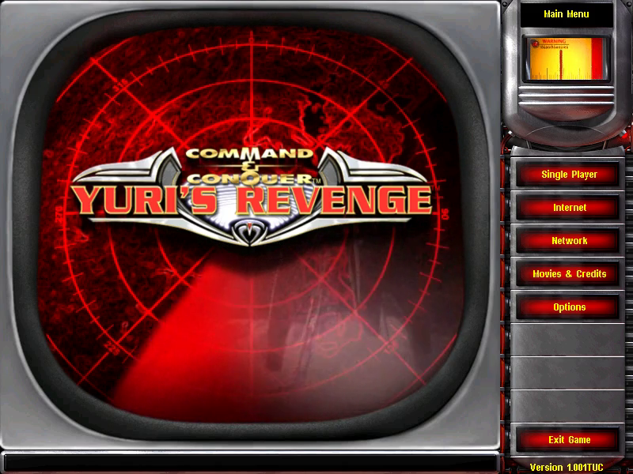

In game, from the playtest suite: the Allied campaign's first mission, the
Soviet one, a skirmish, its setup screen and the score screen at the end.

| | |
|---|---|
| 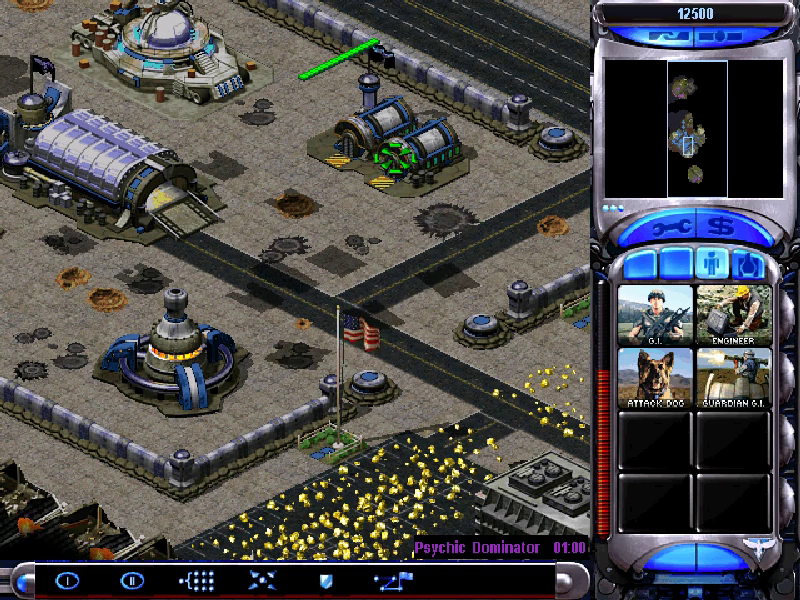 | 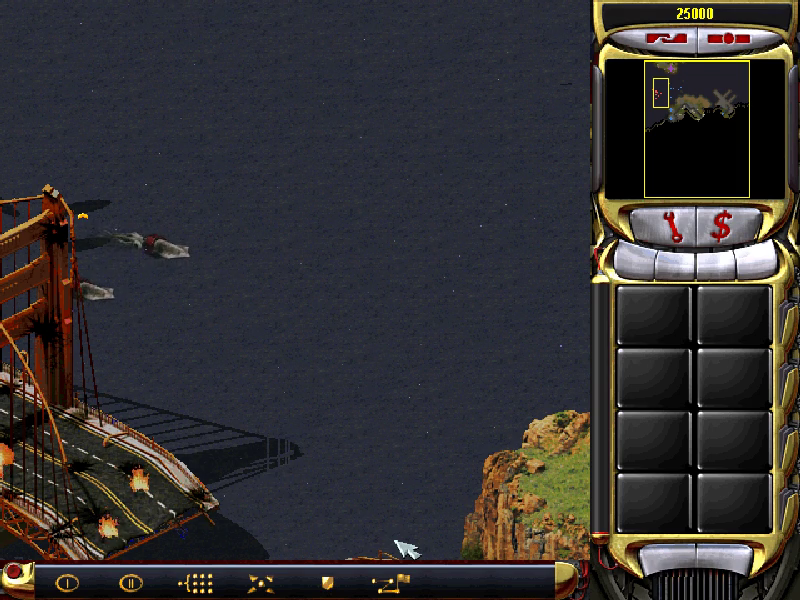 |
| 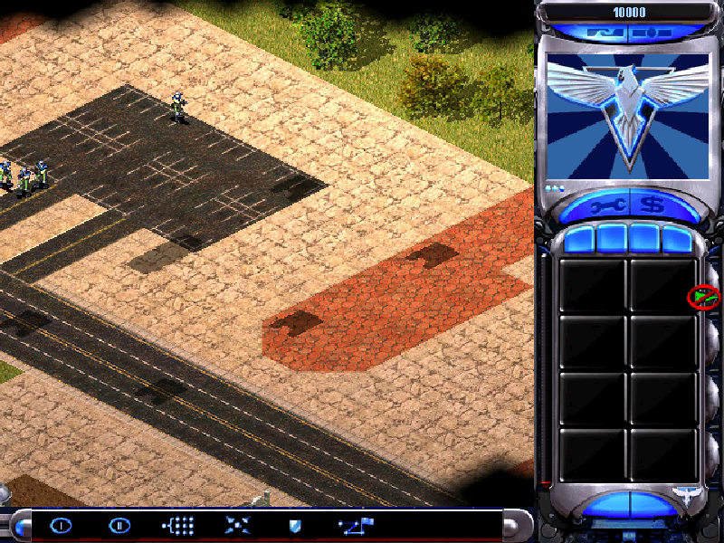 | 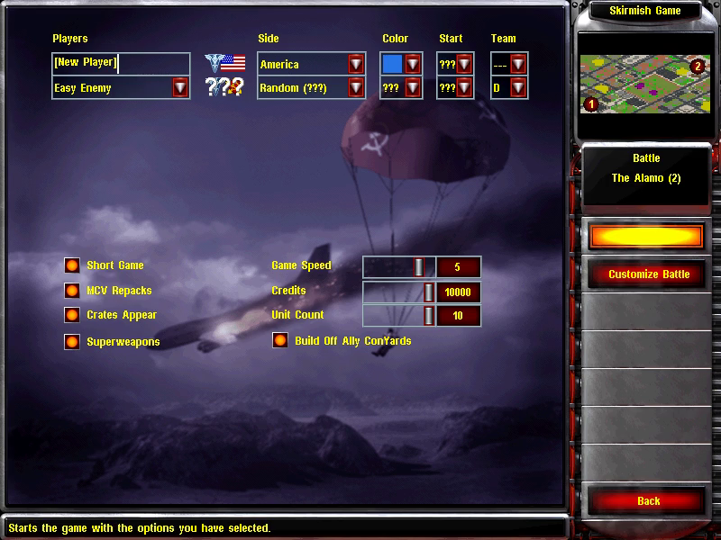 |
| 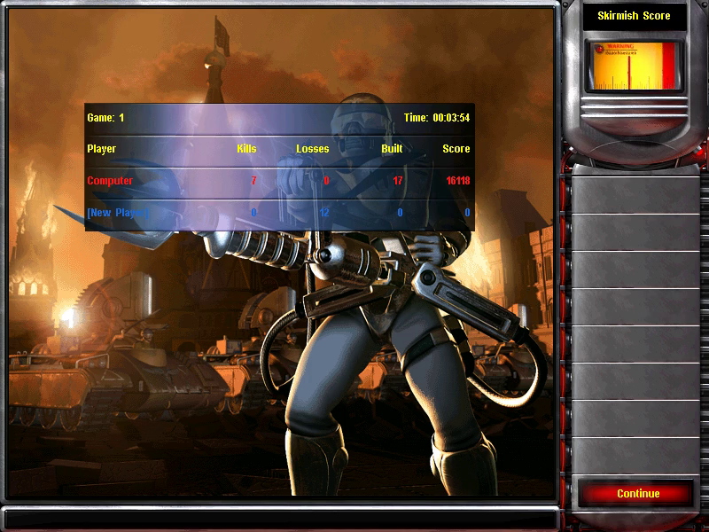 | |

| | | |
|---|---|---|
| 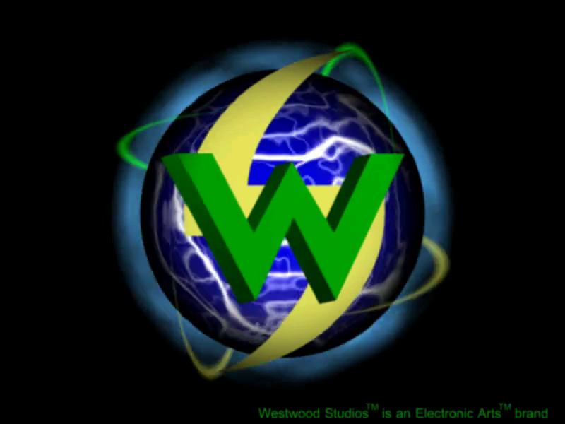 | 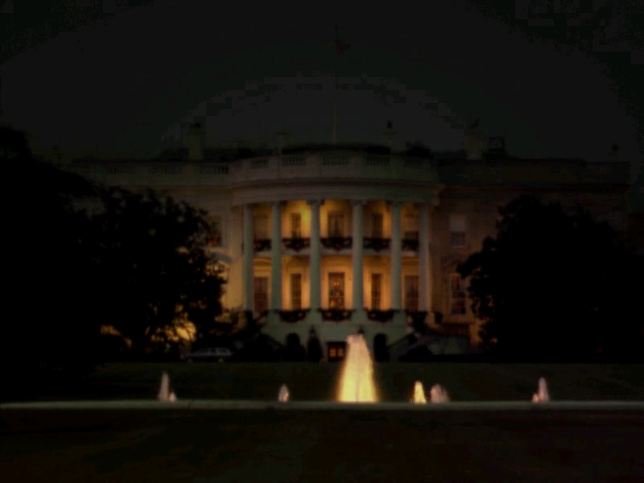 | 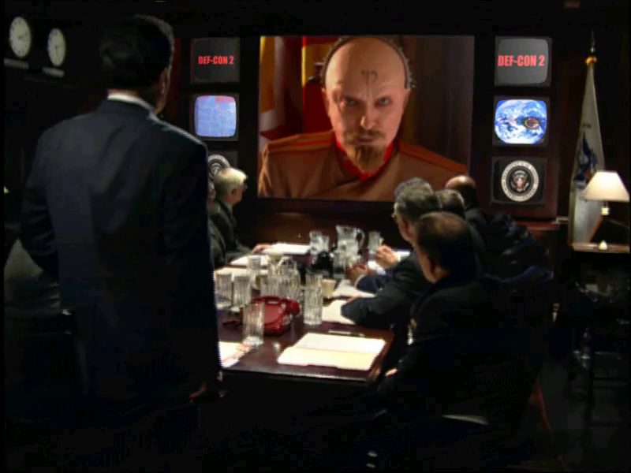 |
| 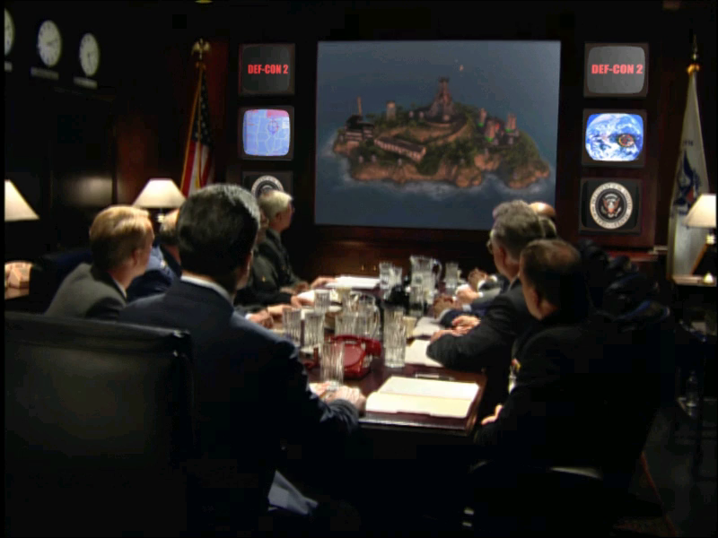 | 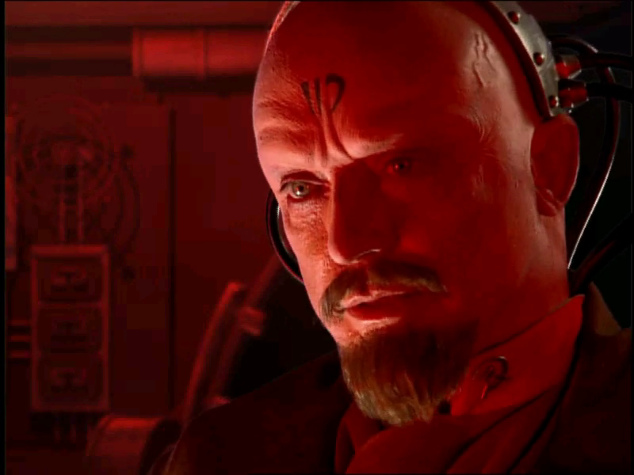 | 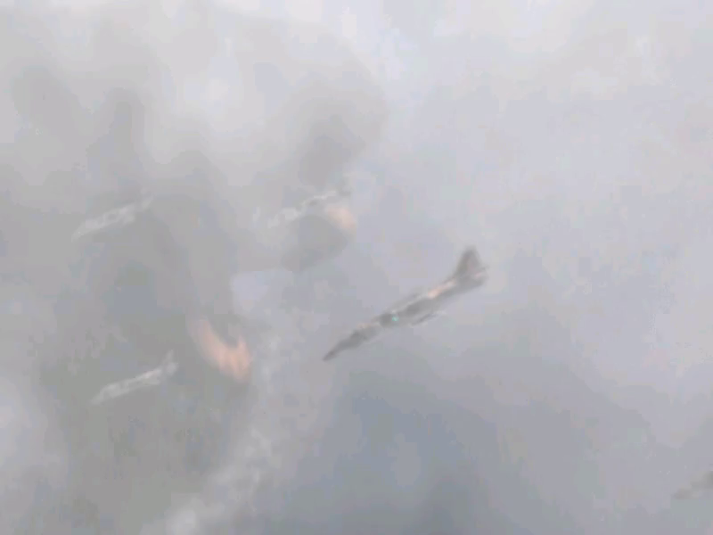 |

## Getting Started

You need **your own copy of Red Alert 2 and Yuri's Revenge**: the Steam build
of *Command & Conquer: Red Alert 2 and Yuri's Revenge* (the folder holding
`gamemd.exe`). Nothing from the game is in this repository and nothing is
downloaded for you. The lifted C is generated on your machine from your copy
and is never distributed.

### Quick start

1. Download this repository (the green **Code** button, then **Download ZIP**)
   and unzip it somewhere with 6 GB free.
2. Double-click **`Setup.cmd`**.

It checks for Python 3.10+, the `pefile` and `capstone` packages, the pcrecomp
toolkit, Visual Studio 2022 with the C++ x86 tools, CMake and Ninja, and
**asks** before installing anything. It finds the game in your Steam library or
asks for the folder, copies it into `game\`, builds the function catalog,
lifts and builds. A rerun skips finished steps. If it stops, it says why in one
sentence; the details are in `setup.log`.

Setup.cmd runs exactly the commands in *Step by step*; it has not yet been
run end to end from a clean folder (ROADMAP), so if it stops, Step by step is
the tested route.

It ends with `Red Alert 2 (recomp).cmd` in this folder, which runs the
recompiled game headless for five minutes and records `boot.mp4`: the intro,
then the main menu. There is no input yet, so that is a bring-up run, not
something to play.

### Step by step

Prerequisites: Windows 10/11, **Python 3.10+** (`py -3 --version`), **git**,
**Visual Studio 2022** (any edition, or the Build Tools) with *Desktop
development with C++* including the x86 tools, **CMake 3.20+** and **Ninja**,
and the pcrecomp toolkit cloned **beside** this repository as `tools`:

```
some-folder\
  tools\        <- git clone https://github.com/sp00nznet/pcrecomp tools
  ra2\          <- this repository
```

1. Python packages:
   ```
   py -3 -m pip install --user pefile capstone
   ```
2. Copy your install into `game\` (about 1.9 GB):
   ```
   robocopy "C:\Program Files (x86)\Steam\steamapps\common\Command & Conquer Red Alert II" game /E
   ```
3. Headers, imports and C++ classes (seconds):
   ```
   py -3 ..\tools\tools\pe\pe_analyze.py game\gamemd.exe --json work\pe_analysis.json
   py -3 ..\tools\tools\cpp\rtti.py game\gamemd.exe -o work\rtti.json --seeds work\rtti_seeds.json
   ```
   Expected from `rtti.py`: `classes : 954` and `virtual methods : 6,665`.
4. The function catalog (about 15 minutes):
   ```
   py -3 ..\tools\tools\disasm\disasm32.py game\gamemd.exe -o work\functions.json --seed-functions work\rtti_seeds.json
   ```
   Expected: `Functions: 22682` and `Byte coverage: ... (89.0% of code range)`.
5. Lift (5 to 15 minutes):
   ```
   py -3 run_lift.py --all
   ```
   Expected: `lifted 23458   not-lifted stubs 0   errors 0`.
6. Build (from a plain terminal; `build.cmd` sets up the x86 compiler itself):
   ```
   build.cmd
   ```
7. Run it headless:
   ```
   build\ra2.exe --headless --run --watchdog 60
   ```

The usual trip-ups: `python` opening the Microsoft Store (that is Windows' alias;
use `py -3`), and a PATH change that needs a new terminal window.

## Usage

```
build\ra2.exe                                   # dry run: map and bind, print the entry point
build\ra2.exe --run                             # play: our own window, sharp scaling (F12), fullscreen (F11)
build\ra2.exe --run --fullscreen --scale crt     # borderless fullscreen, CRT look
build\ra2.exe --run --classic                   # the original exclusive-fullscreen DirectDraw
build\ra2.exe --headless --run --watchdog 60    # no window, no mode change, stop after 60 s
build\ra2.exe --headless --run --record out.mp4 --frames 300
py -3 tools\conformance.py                      # boot milestones + lift health vs the baseline
py -3 tools\playtest.py --jobs 3                 # every menu and game mode, scripted (docs\testing.md)
py -3 tools\playtest.py campaign-allied --original   # the same script on the shipping code
```

Scripted input (headless only): `--press DLG:CTRL@s` presses a menu button by
dialog and control ID once that screen is open, `--select DLG:CTRL=N@s`,
`--waitlog TEXT@s`, `--key`, `--move`, `--click`, `--wait`. `--original` runs
the shipping machine code under the same host.

Diagnostics: `--debuglog` (the game's own debug log), `--native-trace`
(every call into Windows), `--callbacks`,
`--probe VA`, and with a `-DRA2_TRACE=ON` build `--calltrace FILE` and the
other pcrecomp trace options (`build\ra2.exe --help`).

## Building from source

Steps 5 and 6 above. `PCRECOMP` (environment, for `run_lift.py`) and
`-DPCRECOMP=` (CMake) point at a toolkit checkout other than `..\tools`; the
lifter and the runtime must come from the same tree.

The lift needs three pcrecomp fixes found here and not yet merged: #41
(mid-body fall-through), #42 (lifted loops yield the machine) and #43
(push/jmp inside a body). Until they are, lift from a checkout with all three
merged into `main`.

## Documentation

- [docs/RECON.md](docs/RECON.md): the binaries, the build and the class map
- [docs/host.md](docs/host.md): the host, headless DirectDraw, registration-free COM
- [docs/presenter.md](docs/presenter.md): the presenter window, scaling, the virtual screen
- [docs/hires.md](docs/hires.md): high resolution and widescreen, and the 4K limit
- [docs/bringup.md](docs/bringup.md): every wall so far and its fix
- [docs/testing.md](docs/testing.md): the playtest suite, scripted input and the `--original` oracle
- [ROADMAP.md](ROADMAP.md), [CHANGELOG.md](CHANGELOG.md)

## License

MIT for this repository's own code ([LICENSE](LICENSE)). Red Alert 2 and
Yuri's Revenge are © Electronic Arts; none of their files, and nothing
generated from them, is in this repository.
