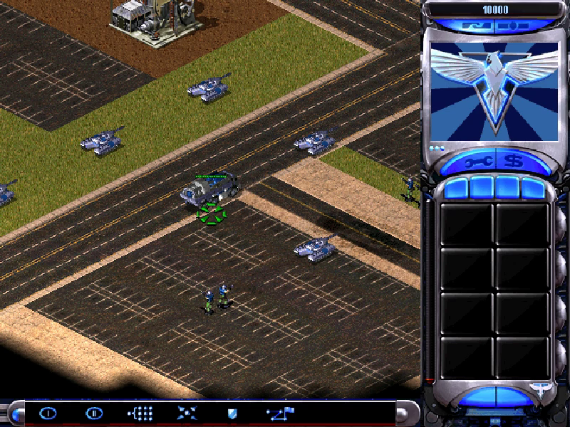

# Bring-up log

Each wall the recompiled `gamemd.exe` hit on the way up, with the evidence and
the fix. Newest last. Commands are run from the repo root over RDP, so every
run is `--headless` (REPO_RULES section 13).

## 1. Thirteen static constructors were never lifted

```
  entering 0x007CD80F
ICALL: unresolved VA 0x0040FF90 from 0x007CBED3
ICALL: unresolved VA 0x00410010 from 0x007CBED3
...                                              (13 in all)
[messagebox] type 0x30 -> 1: ***FATAL*** String Manager failed to initilaized properly
```

`0x007CBED3` is the CRT's `_initterm`, walking the C++ constructor tables
(`__xc_a`..`__xc_z` and the C initialisers). The tables hold 3,952 function
pointers; 13 of them were not in the catalog. An unresolved `RECOMP_ICALL`
answers `eax = 0` and carries on, so the run went on without those globals.

Fix: `run_lift.py` injects addresses (`RUN_SEEDS`, and `--seeds` for more)
the catalog lacks. All 3,952 table entries were read statically and the 13
missing ones seeded at once. Root cause of most of them: see 4.

## 2. The "String Manager" box is really a COM check

The message box above survived the constructors. The string fetch that
produced it is `0x00734E60`: it returns that fatal text whenever the CSF
string table is not loaded yet, so any error before the language MIX loads
shows up as "String Manager failed". The real error was a few lines earlier
in WinMain (`0x006BD6CA`): a flag set when the game cannot create its COM
servers.

`Blowfish.dll`, the Westwood Online cipher, ships in the game folder as an
in-process COM server. WinMain `CoCreateInstance`s it, falls back to
`LoadLibrary` + `DllRegisterServer`, and retries. The Steam install script
registers it under `HKCR` with admin rights; on this machine it never had, and
an unelevated `DllRegisterServer` returns `S_OK` while writing nothing.

Fix (host): `CoCreateInstance` answering `REGDB_E_CLASSNOTREG` is retried
against the game folder's own servers through `DllGetClassObject`, the way a
side-by-side manifest would. Nothing is written to the registry and no admin
step is needed.

```
[com] class 1440AD10 not registered: served by Blowfish.dll -> 0x00000000
[headless] CreateWindowExA("Yuri's Revenge", 1804x972) from sub_00777C30 -> hidden hwnd 00CC0B76
[headless] DirectDrawCreate -> 0x00000000
[headless] SetCooperativeLevel(0x11) -> NORMAL: 0x00000000
[headless] SetDisplayMode(800x600x16) -> kept, not applied
```

Not needed: the launcher check. The Steam build already returns true from
`0x0049F5C0` (`mov al, 1; ret`), so `gamemd.exe` runs without `RA2MD.exe`.

## 3. Surfaces with a format need a type

```
[headless] CreateSurface(flags 0x7 caps 0x0 64x64) -> 0x88760091
=== fault 0xC0000005 ... in lifted sub_004BAD80
```

Headless DirectDraw gives every surface without a pixel format the game's
16-bit RGB565 (a 32-bit desktop would hand out 32-bit ones). A surface with
caps 0 and an explicit format is `DDERR_INVALIDPIXELFORMAT`; it has to say
`DDSCAPS_OFFSCREENPLAIN`. The game does not check the result, hence the fault.

## 4. Catalog entries in alignment padding hid 66 real functions

```
ICALL: unresolved VA 0x0040A090 from 0x00402C70
=== fault 0xC0000005 ... write of 0x00000094 (null/low) in lifted sub_00407860
```

`0x0040A090` is named by a data table (`0x00816374`) and is a perfectly
ordinary method. The catalog had an entry at `0x0040A08E` instead: two bytes
into the `nop` run before it, put there by a `call rel32` decoded out of the
middle of another instruction. Decoded as a function, that entry walked the
padding into the real body and owned its instructions, so when the data scan
reached `0x0040A090` it was already "covered" and skipped.

66 catalog entries were like that, each hiding the 16-byte-aligned function
behind it; `0x0045B110`, one of the 13 constructors in 1, is another.

Fix (toolkit): disasm32 moves a candidate whose bytes up to the next 16-byte
boundary are all `nop`/`int3` to that boundary
(pcrecomp #32).

## 5. The intro video is centred on the real desktop

```
[headless] CreateSurface(flags 0x1 caps 0x200 800x600) primary -> 0x00000000
[headless] frame 1 blitted to the primary
=== fault 0xC0000005 at 0x10016B7D
  write of 0x0EF2B000
  in lifted sub_00432F36, last native call binkw32.dll!_BinkCopyToBuffer@28
```

The first frame is in, then Bink writes past the end of the primary. Its
arguments, logged from a shim: `copy 800x600 -> pitch 1600 h 600 at 560,240`.
560,240 is an 800x600 movie centred on 1920x1080, the real desktop. In
fullscreen the mode change would have made the screen 800x600 first; headless
it never happened. The movie player also adds the window's client origin
(`ClientToScreen`, `0x00432EF0`), which in fullscreen is 0,0.

Fix (host, headless): after `SetDisplayMode` the hidden window is resized to
the mode, `GetSystemMetrics(SM_CXSCREEN/SM_CYSCREEN)` answers the mode, and
`ClientToScreen`/`ScreenToClient` are identity. That is the world the game was
written for: one window that is the whole screen.

## 6. The intro plays, and Bink's pacing stalls

With 5 fixed the recording still showed one frame for 90 s. Not the game: the
recorder held the primary's lock while writing 1.9 MB to the ffmpeg pipe, and
the game's own `Lock` of the primary waited on it. The recorder now copies the
frame out under the lock and converts after; frame checksums go to the log
every 300 frames.

```
[record] frame 600 at 0FE98028 checksum 04EE4C3E
[record] frame 900 at 0FE98028 checksum E62E9C39
[record] frame 1200 at 0FE98028 checksum EA66FFAB
[record] frame 1500 at 0FE98028 checksum EA66FFAB      <- frozen from here
```

The Westwood logo and the Yuri's Revenge intro (800x600, 3,579 frames at
15 fps, about 4 minutes) play, drawn by Bink into the primary. Then the picture
freezes and stays frozen: the game spins in `BinkWait` (59.6M calls in 150 s),
and Bink never says the next frame is due.

| Bink sound | Runs | Froze at |
|---|---|---|
| on (DirectSound) | 2 | ~40 s, both |
| off (`BinkSetSoundSystem` refused) | 2 | ~110 s; not within 150 s |

So sound made it reliable but did not cause it. For a while headless refused
Bink's sound system as a stopgap; section 7 found the real cause, and movies
have their sound back.

## 7. The movie stall was focus, not Bink

Section 6's stall turned out to be the game pausing its own movie. The movie
loop (`0x00432E80`) calls `BinkPause(1)` whenever `GameInFocus`
(`0x00A8ED80`) is clear, and the window procedure sets that byte from the
`wParam` of activation messages (`0x007778CE`). A hidden window is never the
foreground one, so whenever Windows said so, the movie paused for good. When
that happened depended on timing, which is why the traced (slower) build
stalled more and why sound made it worse.

Fix (host, headless): `RegisterClassA` wraps the game's window procedure, and
every `WM_ACTIVATEAPP`/`WM_ACTIVATE`/`WM_NCACTIVATE` reaches it as "active"
(`WM_KILLFOCUS` is dropped). `GetActiveWindow`, `GetForegroundWindow` and
`GetFocus` answer the game's window, and `ShowWindow` delivers the activation
a fullscreen window gets. The guest procedure is called with
`CallWindowProcA`; native32 runs the lifted body when Windows calls into guest
code.

## 8. The debug log, and a NULL module

The retail `gamemd.exe` compiled its debug printf out (`0x004068E0` is a bare
`ret`). `run_lift.py` now has `HOOKS`: functions whose body is the host's.
`ra2_hook_004068E0` formats the arguments off the guest stack, and
`--debuglog` prints the game's own log at almost no cost:

```
[game] Init CDROM
[game] Calling Force_CD_Available
[game] Init Rules
...
[game] Game Init Completed.
[game] Theme::PlaySong(0) - Repeating
```

After `Game Init Completed` the main-menu routine (`0x00531CC0`) returned at
once, as if Exit had been picked, and the game shut down (the `ebp = 0x43`
fault on the way out is a separate, open bug). `--native-trace` showed why:

```
[native] KERNEL32.dll!FindResourceA (00000000 000000E2 00000005 00000000) from sub_004A3B40 -> 00000000
```

Dialog `0xE2` is the main menu (`GUI:SinglePlayer`, `GUI:Options`, ...). A
NULL module means "the process's exe", and the process's exe is the host.
Fix (host): `FindResourceA`, `LoadResource`, `CreateDialogParamA` and
`DialogBoxParamA` map a NULL module to the guest image.

With that, the game draws its menu frame: the sidebar, the red map backdrop
and the meter panel, all its own art, rendered by the recompiled code.

## 9. A missing fall-through after a call: the insert-disc box

The menu frame came up with an insert-disc box (`TXT_CD_DIALOG_1`) in it. The
Steam build's CD check is patched to pass (`0x004A80D0` is `mov eax, 2; ret`),
so init found "disc 2" and built a search path from the drive list
(`sprintf("%c:\\")` and an inline strcat at `0x0052C424`). The path came out
as `";"`, and `Set_Search_Drives` with no drive asks for the disc.

The lift of init was missing code. After `call sprintf` at `0x0052C438` the
generated C went straight on to `L_0052C4C0`, and `0x0052C43D..0x0052C4BF`
(the strcat and the rest of the loop) was not there.

The catalog has a false entry at `0x0052C43D`, the return address of that
call. The extent walk reads "a call followed by an entry" as a call that never
returns, and stops there. Then the emitter placed the next instruction it had
straight after the call, so control fell into unrelated code.

Fix (toolkit, `generate.py`): a gap in the middle of a body ends with a goto
to the fall-through address if it is in the body, or a tail transfer to it if
not, as the end of a body already did (pcrecomp #41).

Not needed after all: `-CD.` on the guest command line. It was a workaround
for 8, and it does set the "disc present" flag (`0x0052F7AF`), but the Steam
build runs without it.

## 10. Hidden windows are never painted: the main menu

With 9 fixed, init completed and the main menu opened (dialog `0xE2`, and its
looping background movie), but the screen showed the menu frame and nine empty
button slots, and never changed. `--native-trace` over a minute at the menu:

```
5213222 USER32.dll!PeekMessageA
   1288 USER32.dll!InvalidateRect
      0 BeginPaint
```

RA2's menus are real Win32 dialogs whose controls the game paints itself, and
a hidden window gets no `WM_PAINT`. So headless no longer hides the game's
windows: a top-level window (and a top-level dialog, with `WS_VISIBLE` cleared
in its template for the create) is made layered at alpha 0, click-through
(`WS_EX_TRANSPARENT`), never activated (`WS_EX_NOACTIVATE`) and off the taskbar
(`WS_EX_TOOLWINDOW`), then shown with `SW_SHOWNOACTIVATE`. Windows treats it as
visible and paints it; nothing appears on any screen, and it cannot take over
an RDP session.

```
[headless] CreateDialogIndirectParamA(child) -> hwnd 0590215C
[game] Play_Movie() as Bink!
[game] Looping movie
```

The main menu then draws completely: Single Player, Internet, Network, Movies
& Credits, Options, Exit Game, the animated backdrop, and `Version 1.001TUC`.
With movie sound back on (7), a five-minute run plays the whole intro and
reaches the menu: conformance 8/8.

## 11. Into the game: what the playtest suite turned up

Driving the game through every menu and mode (`tools/playtest.py`,
[testing.md](testing.md)) found these, each pinned on the lift or the host by
running the same script on the shipping code (`--original`):

| Symptom | Whose | Cause and fix |
|---|---|---|
| A crash pressing Skirmish: execute of `0x006163A0` | catalog | Two window procedures named only by `mov reg, imm` and sitting behind jump tables were never catalogued (`0x006163A0`, `0x00618D40`). Seeded in `run_lift.py` (`RUN_SEEDS`). |
| In-game recording sheared into stripes | host | The game plays at 640x480 and the menus at 800x600; the recorder now scales every frame to the size it started with. |
| A fault in the recorder at the mode switch and at exit, on both machines | host | The recorder held a raw pointer to a primary surface the game had released (and at exit, the DirectDraw object that owns it). The host now holds its own reference, swaps it under a lock, and drops it when `IDirectDraw::Release` really frees the object. |
| The battlefield black | host | Edge scrolling. The last menu press left the scripted cursor at x=720, and the game runs at 640x480: past the right edge, so auto-scroll ran the view to the map's black margin and held it there, on both machines. The host now keeps the cursor on screen across a mode change (as Windows does), and in-game cases put it in the middle of the battlefield. |
| The idle player defeated | neither | At start cell 52,97 the AI beats a player who does nothing in about 4.5 minutes, on the shipping code too. The suite now plays a skirmish through to that defeat, the score screen and back. |
| Exit Game hung after "Theme::Stop(0) - Fading" | lift (toolkit) | The main thread spins at `0x0040A047` waiting for the sound thread, and native32 only handed the machine over at native calls. Lifted loops now yield it every 65,536 back-edges (pcrecomp #42). |
| LAN New Game: execute of `0x24` | lift (toolkit) | `push 0x00617250; jmp 0x00618B9D` (an argument and a jump to the procedure's own epilogue) was lifted as a call returning to `0x00617250`, which restarted the procedure on a scrambled stack (pcrecomp #43). |
| The campaign emblems did nothing | script | They are static controls, and a static passes its clicks to the dialog. `--press` on a static now clicks the dialog at that point. |

## 12. Every vehicle invisible: a MASM alignment filler

Mapping the voxel renderer for HD voxels ([voxels.md](voxels.md)) showed
that in the recomp no vehicle was ever drawn: shadows, health bars and
selection boxes, but no MCV and no tanks, where `--original` drew them all.
Every in-game run logged hundreds of `ICALL: unresolved VA 0x007DF9C0`: the
voxel rasterizers are hand-written assembly behind a table, padded with
MASM's `align 16` fillers that end in `mov edi, edi`, which disasm32 read as a
hot-patch prologue. Each function started two bytes early and the table's
entries had none. The catalog fix (pcrecomp #44) moves the
three entries to where the table points, and the playtest suite now fails a
run on any unresolved `ICALL`: an unresolved indirect call returns 0 and the
game carries on, so the suite passed 28/28 with every vehicle missing.



## 13. Red Alert 2 itself: the same host, a second target

`game.exe`, in the same install, is Red Alert 2 without the expansion: the
same engine a year younger, 23,192 functions. `run_lift.py --target game`
lifts it into `src/recomp/gen_game` with its own seeds (a static constructor
and a callback named only by an immediate), its own debug-log hook
(0x004068F0) and its own patches, and writes `recomp_target.h` beside the
lifted C: the exe and INI names, the window title and the debug-log
address, the only things the host needs to know about which game it runs.
`RA2_TARGET=game` in CMake builds it (`build-game\ra2.exe`). Everything else
is found again by shape: the sidebar's row cap ([hires.md](hires.md)), the
options object (0x00A40B18, width and height at +0x20) and all 19 HD-voxel
sites and nine globals, with the same instructions and stack offsets but
for the frame blitter's frame.

Out of the box 27 of 30 cases passed. Every skirmish ended in the human's
defeat about 16 seconds in, on the shipping code too, and the enemy had a
full base and a charged nuclear missile by then. It looked like copy
protection (`game.exe` still holds `COPYPROTECTION` strings), but its
launcher check and CD check are already patched to return success. It was
the speed: Red Alert 2's skirmish screen starts at the fastest game speed,
which has no frame cap, and headless that is a few hundred game frames a
second (`Frame 10954` 30 seconds in); the AI gets twelve minutes to the
player's half. Its INI setting does not hold (the screen writes its own
back), so the script moves the speed slider one notch down, as a player
would, with `--select` (which now sets trackbars too).

The last failure, 4K "picture stopped", was the recording. Red Alert 2
starts in the INI's mode rather than at 800x600 menus, so the recorder
opened its video at 3840x2160 and x264 encoded about three frames a second:
617 frames in three minutes against Yuri's Revenge's 4,946, which looked
like a game slowing with resolution. The game itself kept time; the
recording is now at most 1280 wide, and the suite is 30 of 30.

