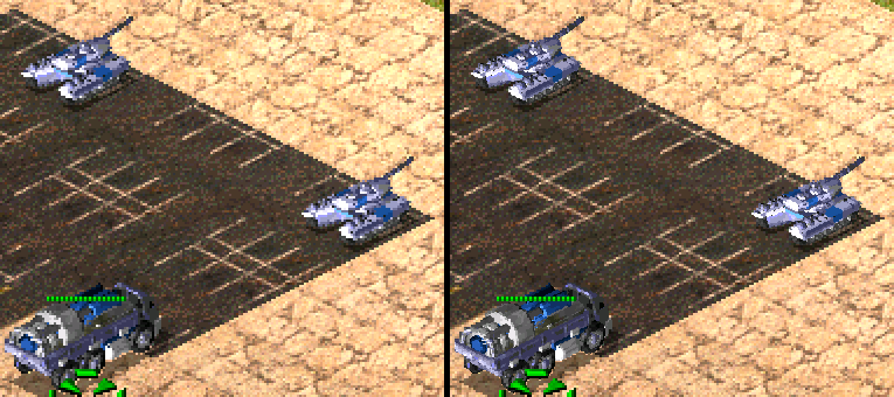

# The voxel renderer

Vehicles, aircraft, some turrets and debris are voxels (`.VXL` models with
`.HVA` animation). This is the map of how Yuri's Revenge draws them, the
groundwork for drawing them at a higher resolution (ROADMAP, HD voxels). It
was built from the catalog's call graph, RTTI vtables, and probes in the
lifted code during a skirmish; addresses are `gamemd.exe` 1.001.

## The path of one unit

```
TechnoClass vtable +0x444    0x00706640  draw a voxel unit (Unit, Aircraft, Building, Infantry share it)
  cache lookup               0x007107E0  key from the arguments; -1 means no cache
  cache hit                  0x00707480  draw the cached image          -> 0x00437A10 / 0x00490E50
  miss: render               0x00706ED0
    view setup               0x00753D00  view matrices 0x00887430 / 0x00887470
    clear                    0x00753E00  clears the last bounding box of both buffers
    per HVA section          0x005AF980  matrix multiply; 0x007540F0 section -> records
    finish                   0x00754510  records -> pixels; returns the image rect
      list at 0x00B3FF78     0x00756860  (count at 0x00B2FB70, 0x48 bytes each)
      list at 0x00B2D958     0x00756590  depth-sorted (count 0x00B2D820, 0x88 bytes each)
        rasterizer           [0x00846840 + mode*4]  32 entries, hand-written assembly
  dirty rect                 0x00B1CFC0..0x00B1CFCC
  shadow                     0x00753C70 (the 256x256 surface), 0x006C89E0
VoxelAnimClass Draw_It +0x114   0x00749B70 -> 0x007542F0
BulletClass Draw_It +0x114      0x00468090 -> 0x0046B0C0 -> 0x00754510
```

## The buffers

| What | Where | |
|---|---|---|
| Colour | `0x00B2FF78`, 256x256, 1 byte | palette indices; pixel = `y * 256 + x` |
| Depth | `0x00B1D5E0`, 256x256 | cleared with the colour when the Z flag (`0x00B43180`) is set |
| Surface | `BSurface` at `0x00B2D928` | wraps the colour buffer; built by the static constructor `0x007539D0` (width 0x100, height 0x100, 1 byte per pixel) |
| Shade table | `voxels.vpl`: palette at `0x00B2FB78`, table at `0x00B41178` | colour = `table[normal_shade * 256 + index]`; loaded at `0x00753B70` |

A unit is rendered once per facing into the 256x256 buffer, cut out by the
rect `0x00754510` returns (offset, source origin, size), kept in the cache,
and drawn onto the battlefield's 16-bit surface through the house palette and
the Z-buffer. The rasterizers plot each voxel two pixels wide
(`[ofs]` and `[ofs + 1]`).

The rasterizer is chosen per section: a base mode from the table at
`0x008468C0`, `| 2` with the Z-buffer, `| 4` when `0x00B43184` is set, `| 8`
when the section's byte `+0xA3` is zero. Mode 4 (`0x007DF9C0`) is the common
one in a skirmish; 5 (`0x007DFAE0`) shows up in the campaigns.

## Invisible vehicles: an alignment filler

Until the catalog fix below, every vehicle was invisible: shadows, health
bars and selection boxes, no unit. The rasterizers are hand-written assembly
aligned with MASM's `align 16`, which pads with `lea` no-ops and closes with
`mov edi, edi`:

```
007df9b7  lea esp, [esp]
007df9be  mov edi, edi        <- the catalog's function start
007df9c0  push ebp            <- the table's entry
```

`8B FF 55 8B EC` reads as a hot-patch prologue, so the function started two
bytes early and `0x007DF9C0` had none: the dispatch at `0x00756843` found
nothing (`ICALL: unresolved VA 0x007DF9C0`), returned 0, and nothing was
drawn. Three entries were affected (`0x007DF9C0`, `0x007DFAE0`,
`0x007DFC00`). The fix is in disasm32's `past_padding` (pcrecomp #44), and the playtest suite now fails a run on any unresolved `ICALL`.

## HD voxels

With HD voxels on (the presenter's settings menu, F10; `--hd-voxels`),
vehicles are drawn at twice the resolution of the rest of the picture. The
game is untouched: everything it draws, reads and caches is what it would
have been, and the 2x pixels exist only in the presenter's frame.



*Left, the frame scaled up; right, the same frame with HD voxels.*

**Rendering at 2x.** A plain 2x projection is out: the rasterizers walk 8.8
fixed point in a 256-wide buffer and plot each voxel as a fixed splat, so a
bigger image overflows their coordinates and leaves holes between voxels.
Instead the render's finish stage (`0x00754510`, records to pixels) runs three
more times with every span starting half a pixel further left, up, or both
(the span record's starts at `+0x18`/`+0x1A`, patched at `0x0075683E`). Each
pass is a complete, hole-free 1x render of the model sampled at a different
offset; interleaved, the four are one image at 2x. The finish stage is only
the last step, so the passes cost little: about 1 ms a frame in a skirmish.

**Following the image onto the battlefield.** A unit is built in a 256x256
staging surface (`[0x00B1D13C]`): each part (body, turret, barrel) is blitted
into it through a remap, then the whole is copied onto the battlefield with
the house palette, lighting and the Z-buffer (`0x004373B0`, called at
`0x0073B446`). Rather than reimplement those blitters, the host watches them:

- around each part's blit into staging it learns the remap from what the blit
  wrote, and keeps the part's 2x image remapped (a "stamp");
- around the copy onto the battlefield it learns each index's final colour
  and which pixels the unit really got (the Z-buffer's say) from the
  battlefield before and after, and records the unit's 2x colours for them
  (a stamp's pixels count only where a later part did not cover them; where
  the 2x image is transparent, what was under the unit shows);
- the copy into the frame surface (`[0x00887308]`, the primary) ends the
  frame, and the records are published.

The battlefield surface is locked by the game while it draws; its pixels are
at `DSurface+0x14` and DirectDraw gives the pitch.

**Showing it.** The presenter asks for the frame at 2x
(`host_frame_hd`): each 1x pixel four times, except where a unit's record
says the finished frame still shows exactly what the unit wrote there; those
get the four 2x pixels. Anything drawn over a unit afterwards (a health bar,
a selection box, smoke, a building in front) changes the 1x pixel, and that
pixel stays 1x. In a skirmish 98% of the units' pixels show at 2x.

**While it is on** the voxel cache is off (`0x007067E4`), so every unit is
rendered every frame, as the rules' `DisableVoxelCache` would. The 2x frame
needs twice the game's resolution to fit the presenter's 4096x2160 frame: up
to 2048x1080; above that the presenter shows the 1x frame.

**Not yet:** the shadow, aircraft (their copy is at `0x0073CDE9`), voxel
animations and debris, and buildings' voxel parts stay 1x. A unit cut off at
the edge of the staging surface stays 1x.
